<p align="center">
 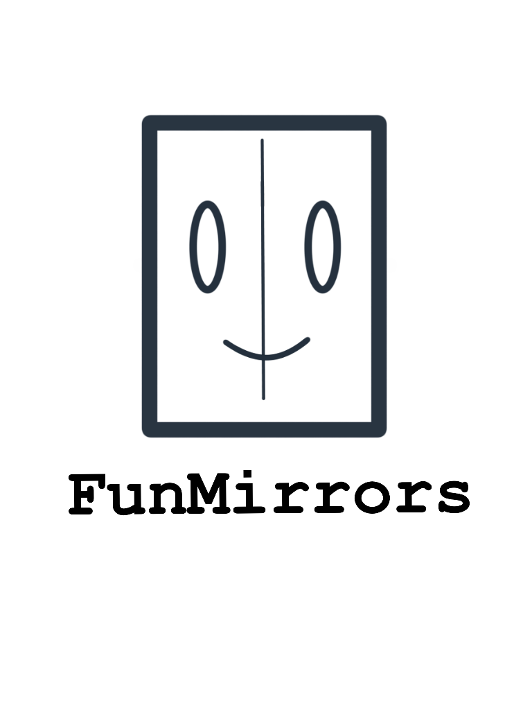
</p>

## Project in brief
I developed this fun project as an application of the following concepts:

* Camera projection matrix
* Camera intrinsic and extrinsic parameters
* Image remapping

Main objective of this project is to explain above mentioned fundamental concepts in an interesting and fun way. 
A detailed explaination of the above fundamental concepts can be found at [this blog from learnopencv.com](https://www.learnopencv.com/geometry-of-image-formation/). The opportuinity to sit through the CS763: Computer Vision Spring 2020 course at IIT Bombay also helped me to clear my fundamental concepts related to the geometry of image formation and camera projection matrix. These topics are an essential part of this project.

I will explain the basics of above topics first and then I will explain how I combined all the concepts together.Before that let's have a look at some fun results!!

## Fun Results
<p align="center">
 
</p>
<p align="center">
 Input and output of Babyfy mirror
</p>

<p align="center">
 
</p>
<p align="center">
 Input and output of HulkMode mirror
</p>

<p align="center">
 
</p>
<p align="center">
 Input and output of Squeezoo mirror
</p>

<p align="center">
 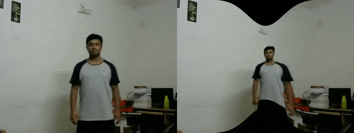
</p>
<p align="center">
 Input and output of Strectchee mirror
</p>


The implimentation of virtual camera that I am using is explained in [this repository](https://github.com/kaustubh-sadekar/VirtualCam) It explains how you can change different camera parameters to generate various effects. These two projects aim towards motivating computer vision enthusiasts to study fundamenta concepts related to image formation and camera projection.
 
##### [Virtual camera class](https://github.com/kaustubh-sadekar/VirtualCam) is used to create all the different types of mirrors. The virtual camera repository also contains a GUI which helps you to modify all the camera parameters and visually understand effect of each parameter on the final generated image.

## Theory

### Understanding camera projection matrix
Camera projection matrix (P) provides a mapping between a 3D world coordinate and its corresponding pixel coordinate in an image captured by the respective camera. It is dependent on **intrinsic** and **extrinsic** parameters of a camera.

**Intrinsic camera parameters**:
Internal properties of a camera that do not change when translating or rotating the camera in the 3D world coordinate frame.
* Focal length (depends on the lens used and mechanical arrangement of camera)
* Apperent pixel size (size if one pixel on the image sensor array)
* Pricipal point offset (principal point : intersection of the image plane and its normal)

**Extrinsic camera parameters**:
External camera properties that are dependent on the camera pose.
* Camera rotation (rotation of camera in the 3D world along all the three axis)
* Camera translation (translation of camera in the 3D world)

Derivation of the camera projection matrix is explained in the following image of my lecture notes which I took while attening the CS763 course.
<p align="center">
  
</p>
<p align="center">
  
</p>

### Creating mirror surfaces using numpy
I have used np.meshgrid to create the entire plane surface in 3D. Some of the planes used are shown below
Mirror using a gaussian function           |  Inverted mirror using an inverted gaussian function  
:-------------------------:|:-------------------------:
  |   

### Projecting these surfaces using the camera projection matrix
Now as explained in the camera projection matrix section we can use the projection matrix to project any 3D point in the image. Using numpy functions and concepts of matrix multiplication we apply the projection matrix to the entire 3D surface. 

Mirror using a gaussian function           |  Projection of the grid in virtual camera  
:-------------------------:|:-------------------------:
  |   


### Image remapping
In image remapping we basically try to change the pixel location. Using mappings U and V we get the new location of x and y coordinates for a given pixel, originally at (x,y) location. Thus we get x_new = U(x,y) and y_new = V(x,y). OpenCV provides a very easy to use method, `remap`. We need to pass the image, and the x and y map i.e. U and V respectively in the above definition. The function basically returns output such that the pixel values at (x,y) in the original image are mapped to (x_new,y_new). This is called forward mapping. To avoid holes we find the inverse mapping such that (x,y) in the original image is determined as `x,y = U_inv(x_new,y_new) , V_inv(x_new,y_new)`.


### Using the projection of the plane as a remapping function and apply remapping the the image to generate different effects
Now we know all the building blocks of this project :
* How to create a virtual camera using numpy and concepts of camera projection
* How to create a 3D plane to be used as out mirror
* How to project the 3D plane in our virtual camera and get the mapping function for remapping the image
* How to use a given map and apply remapping on an image
Following figures show how the mirror is used to generate different effects.

Mirror using a gaussian function           |  Projection of the grid in virtual camera | Effect on remapped image   
:-------------------------:|:-------------------------:|:------------------------------------------:
  |     | 


## Installation and Usage
First you need to install the **vcam** module using pip. You can also download it from the [source](https://github.com/kaustubh-sadekar/VirtualCam)

Install the vcam module using the following command:
```shell
pip3 install vcam`
```
To run the example code use the following command :
```shell
python3 Example1.py`
```

## Creating your own mirrors
Creating your own mirrors and generating some fun effects is very easy using the vcam module. Refer [Example1.py](Example1.py) to get a better idea of writing the full code. To apply FunMirrors on video refer to [Example2.py](Example2.py). Creating your own mirror has three major steps:

* Create the virtual camera object and surface object.
* Change the value of plane.Z using some function of X and Y.
* Project the plane in virtual camera.
* Get mappings using the projected points and apply mesh based warping.

In Example1.py We generate a mirror where for each 3D point, its Z coordinate is defined as 
```python
# Z = 20*exp^[(x/w)^2 / (2*0.1*sqrt(2*pi))]
plane.Z += 20*np.exp(-0.5*((plane.X*1.0/plane.W)/0.1)**2)/(0.1*np.sqrt(2*np.pi))
```

To create your own mirror simply define a new relation Z = F(X,Y) and update plane.Z with its respective equations replacing the above line of code. Some more examples are shared so you can create your own funny mirrors and also try to create the challenge mirrors.

#### mirror 1
```python3
# Z = 20*exp^[(y/h)^2 / (2*0.1*sqrt(2*pi))]
plane.Z += 20*np.exp(-0.5*((plane.Y*1.0/plane.H)/0.1)**2)/(0.1*np.sqrt(2*np.pi))
```
| Effect of the mirror |
| :------------------: |
|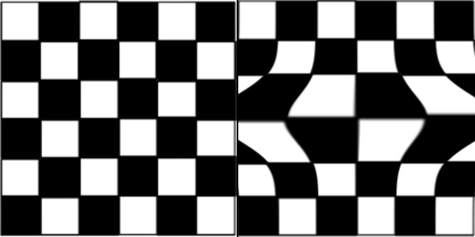|
|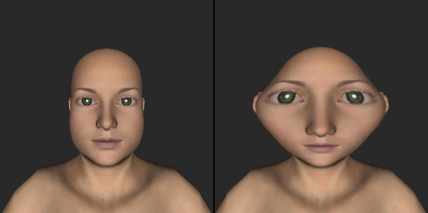|

#### mirror 2
```python3
# Z = -10*exp^[(x/w)^2 / (2*0.1*sqrt(2*pi))]
plane.Z -= 10*np.exp(-0.5*((plane.X*1.0/plane.W)/0.1)**2)/(0.1*np.sqrt(2*np.pi))
```
| Effect of the mirror |
| :------------------: |
|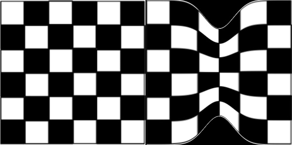|
|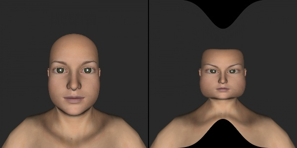|

#### mirror 3
```python3
# Z = -10*exp^[(y/h)^2 / (2*0.1*sqrt(2*pi))]
plane.Z -= 10*np.exp(-0.5*((plane.Y*1.0/plane.W)/0.1)**2)/(0.1*np.sqrt(2*np.pi))
```
| Effect of the mirror |
| :------------------: |
||
|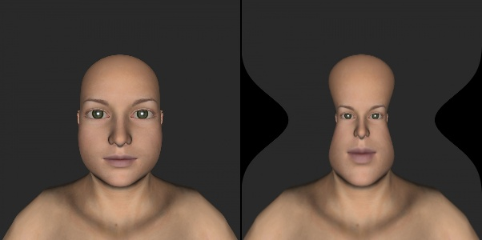|

#### mirror 4
```python3
# Z = 20*[sin(2pi(x/w - 1/4)) + sin(2pi(y/ - 1/4))]
plane.Z += 20*np.sin(2*np.pi*((plane.X-plane.W/4.0)/plane.W)) + 20*np.sin(2*np.pi*((plane.Y-plane.H/4.0)/plane.H))
```
| Effect of the mirror |
| :------------------: |
|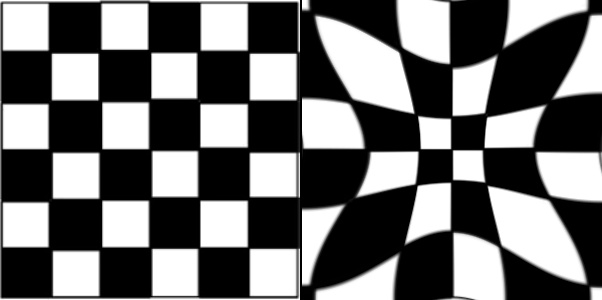|
||

#### mirror 5
```python3
# Z = -20*[sin(2pi(x/w - 1/4)) + sin(2pi(y/ - 1/4))]
plane.Z -= 20*np.sin(2*np.pi*((plane.X-plane.W/4.0)/plane.W)) - 20*np.sin(2*np.pi*((plane.Y-plane.H/4.0)/plane.H))
```
| Effect of the mirror |
| :------------------: |
|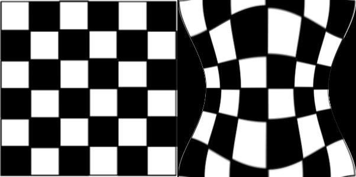|
|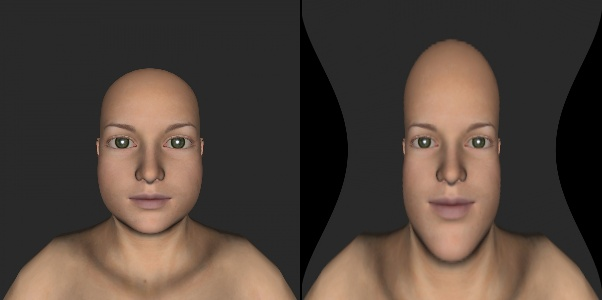|

#### mirror 6
```python3
# Z = -100*sqrt[(x/w)^2 + (y/h)^2]
plane.Z -= 100*np.sqrt((plane.X*1.0/plane.W)**2+(plane.Y*1.0/plane.H)**2)
```
| Effect of the mirror |
| :------------------: |
|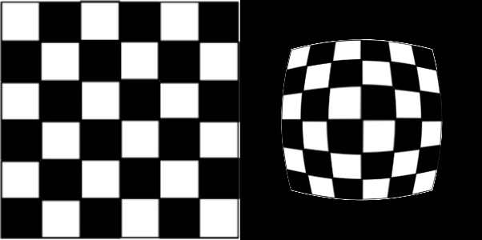|
||


## Challenge Mirrors

All these mirrors are generated by using some function Z = F(X,Y). Try if you can get all the F(X,Y) functions. Images used are [chess image](chess.png) and [face](img3.jpg). Be creative and show your math skills. It's going to be fun.

| **Mirror 1** |
| :------------------: |
|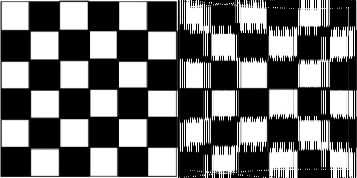|
|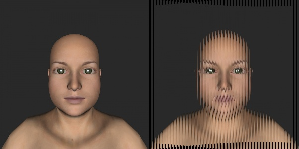|

Solution
```python
#Update your solution here
```

| **Mirror 2** |
| :------------------: |
|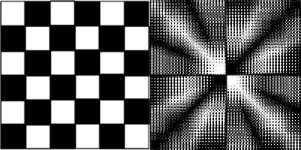|
|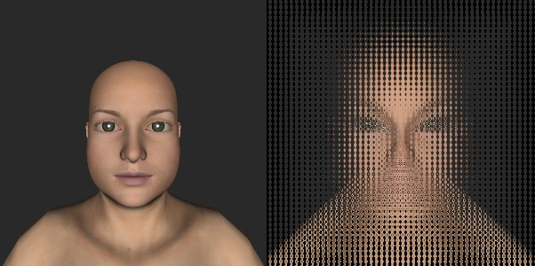|

Solution
```python
# Update your solution here
```

| **Mirror 3** |
| :------------------: |
|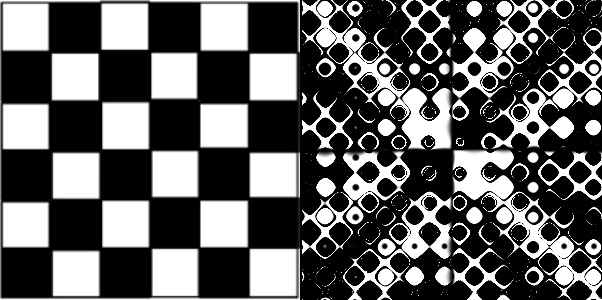|
|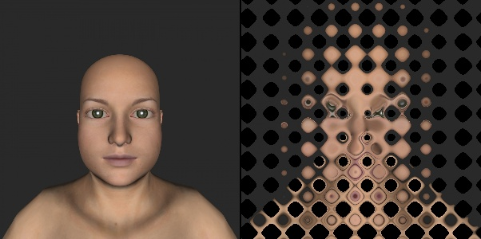|

Solution
```python
# Update your solution here
```

| **Mirror 4** |
| :------------------: |
|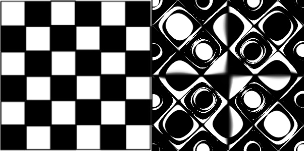|
|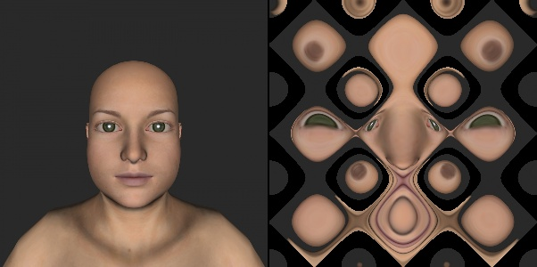|

Solution
```python
# Update your solution here
```

| **Mirror 5** |
| :------------------: |
|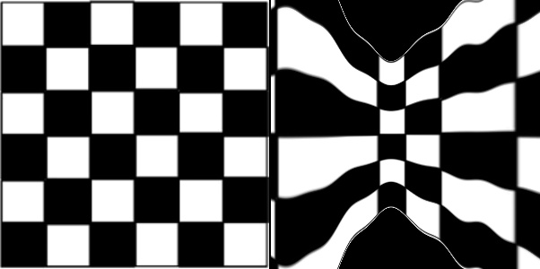|
|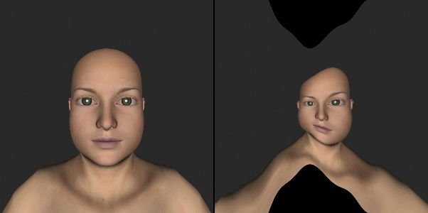|

Solution
```python
# Update your solution here
```

| **Mirror 6** |
| :------------------: |
|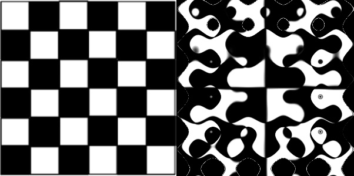|
|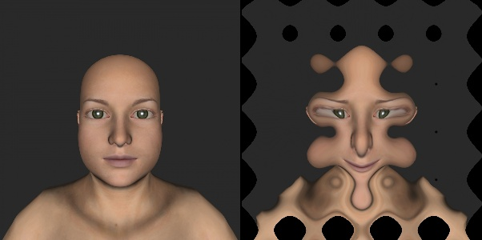|

Solution
```python
# Update your solution here
```


